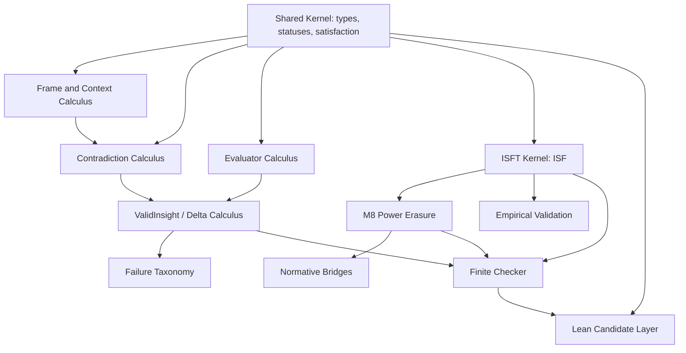

# Dependency Graph

## Reading the Graph

The finite checker covers only selected definitional consequences of ISFT,
M8, and ValidInsight. It does not validate the whole graph. Lean is downstream
of the current signature work and cannot be treated as verified until the
candidate files build successfully.
